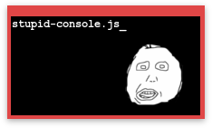

# stupid-console.js
A very simplistic console-like component for websites e.g. to create creative about-pages.

## Features
- History with *Arrow-Up* and *Arrow-Down*
- Scrollable
- Multi Instance Support
- Left-and-right Cursor Navigation
- Command register function

If you have any wishes or ideas, let me know!

Example code:
```js

$(document).ready(function () {
    'use strict';

    //pass unique selector
    var sc = new StupidConsole("#test");
    
    //set default line beginning text
    sc.setDefaultText("foo@bar: $ ");
    
    //called function when no matching command got found
    sc.setErrorCallback(function (args) {
        sc.addNewLine("invalid command!");
    });
    
    //registers click and key handlers, mandatory to use stupid-console.js!
    sc.init();

    //the register function registers functions.
    //the parameters are NAME, CALLBACK FN, (optional) DESCRIPTION
    sc.register("help", function () {
        var commands = sc.commandRegistry.commands;

        for (var cmd in commands) {
            if (commands.hasOwnProperty(cmd)) {
                var description = commands[cmd].description;
                description = (description === "" ? "n/a" : description);
                sc.addNewLine(cmd + ": " + description, false);
            }
        }
    }, "Hilft dir!");

    sc.register("args", function (args) {
        sc.addNewLine("Übergebene Argumente: ");
        console.log(args);
        for (var i = 0; i < args.length; i++) {
            sc.appendCurrentLine((i + 1) + ". " + args[i] + " ");
        }
    }, "");
    sc.register("cls", function () {
        sc.clear();
    });

    sc.register("history", function (args) {
        switch (args[0]) {
            case "-show":
                var history = sc.history.history;
                for (var i = 0; i < history.length; i++) {
                    sc.addNewLine(history[i], false);
                }
                break;
            case "-clear":
                sc.history.clear();
                break;
        }
    }, "-show: zeigt History, -clear: löscht History");
});

```

##License
This projects uses the MIT license.
